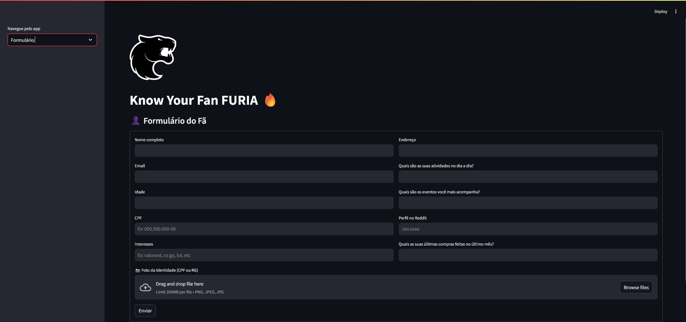
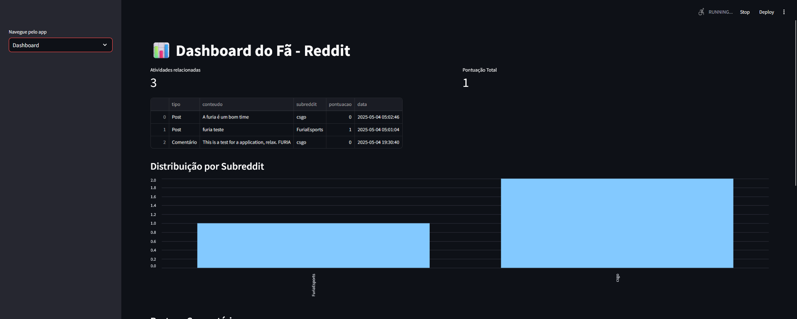
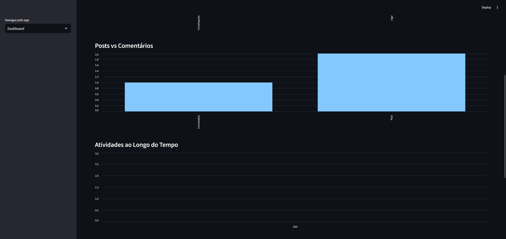
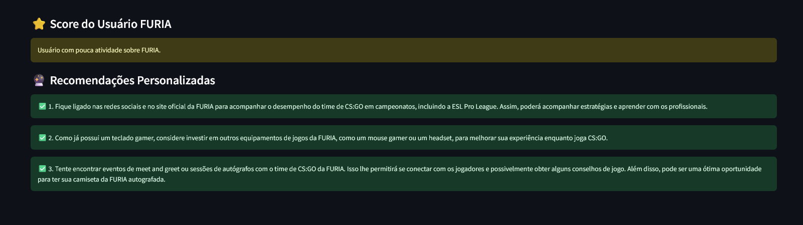

# Know-your-Fan-FURIA
Know Your Fan aproxima as empresas de seus fãs, permitindo entender seus interesses, comportamentos e preferências. A partir desses dados, é possível criar experiências personalizadas e recomendações direcionadas, fortalecendo o relacionamento entre marcas e seus públicos.

# Importante
Devido a maioria dos servidores serem pagos e caso grátis terem limitações, é recomendado que este projeto rode localmente para todas as funcionalidades estarem funcionando, então siga os passos abaixo para fazer a instalação corretamente em sua máquina local. 

# Demo
Formulário

Dashboard




# Estrutura do Projeto
```
Know-your-Fan-FURIA/
├── assets/
│   ├── imgs/
│   ├── user/
├── backend/
│   ├── services/
│   │   └── AIrecomendation.py
│   └── utils/
│       ├── savePhoto.py
│       ├── verifyDocs.py
│       └── verifyFields.py
├── frontend/
│   └── index.py
├── .env.example
├── .gitignore
├── app.py
├── logo.png
├── README.md
└── requirements.txt 
```

# Instalação
1. Vá ao terminal e clone o repositório
    ```
    https://github.com/MusgoNato/Know-your-Fan-FURIA.git
    ``` 
    Acesse a pasta do projeto
    ```
    cd Know-your-Fan-FURIA
    ```
2. Crie um ambiente virtual
    
    - No terminal digite os códigos abaixo:
        
        ```
        python -m venv venv
        ```
        ```
        venv\Scripts\activate
        ```
3. Instale as dependencias
    ```
    pip install -r requirements.txt
    ```

# Configurações
Renomeie o arquivo `.env.example para` para `.env` e configure as seguintes variáveis de ambiente:
```
OPENAI_API_KEY
CLIENT_ID=SEU_CLIENT_ID_DO_REDDIT    # Fica localizado abaixo do icone do aplicativo criado

CLIENT_SECRET=SEU_CLIENT_SECRET_DO_REDDIT # Fica localizado no campo secret
```
- A variavel da OPENAI você deve ter uma conta com acesso a chave API para desenvolvedor. [API OPENAI](https://platform.openai.com/api-keys)
- As variaveis do REDDIT você pode acessar criando um aplicativo de desenvolvedor do tipo script nesta página do reddit: [API REDDIT](https://www.reddit.com/prefs/apps)

# Pré-Requisitos
- Python 3.9+
- Conta no Reddit (para acessar a API)
- Tesseract OCR instalado e no PATH (usado na extração de CPF via imagem). É de suma importância instalar o projeto em C:\Program FIles, marque a opção “Add to PATH”. [TESSERACT](https://tesseract-ocr.github.io/tessdoc/Downloads.html)

# Execução do projeto
No terminal execute a linha de código a seguir:
```
streamlit run app.py
```

# Bibliotecas utilizadas
- openai==1.77.0
- pandas==2.2.3
- Pillow==11.2.1
- praw==7.8.1
- pytesseract==0.3.13
- python-dotenv==1.1.0
- streamlit==1.42.0


# 👨‍💻 Desenvolvedor

Este projeto foi desenvolvido por:

Hugo Josue
- 📧 hugojosue03@gmail.com
- 🔗 [LinkedIn](www.linkedin.com/in/hugo-josue-25246525b) | [GitHub](https://github.com/MusgoNato)